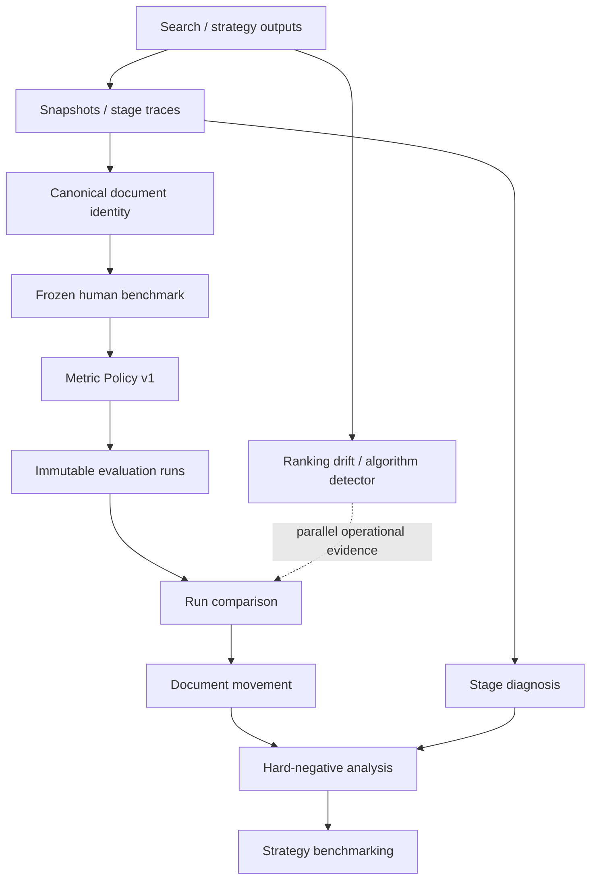
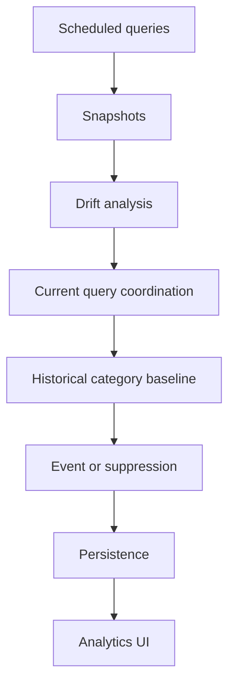

# Exa Ranking Lab

Exa Ranking Lab is a search-quality observability and evaluation workspace for tracking ranking change, measuring judged relevance, diagnosing document movement across recorded retrieval stages, and comparing search strategies on frozen benchmarks.

## Why it exists

```text
ranking changed ≠ search quality changed
```

Ranking drift is an operational signal. Human relevance judgments and reproducible metric policy are needed to determine whether measured search quality changed. The Lab keeps global drift, metric deltas, document movement, stage evidence, and strategy tradeoffs separate so the evidence remains auditable.

## Core capabilities

* Query execution, immutable snapshots, ranking drift, and algorithm-change evidence
* Canonical document identity and separate content identity for reliable drift attribution
* Frozen human benchmarks with accepted `0/1/2` judgments and canonical document identity
* nDCG, benchmark-relative Recall, MRR, Hit, Judged Precision, and Judgment Coverage
* Immutable evaluation runs, relevance-aware comparison, and query gains/losses
* Canonical judged-document movement and top-K transitions
* Canonical identity-aware drift comparison across recorded ranking snapshots
* Generic candidate/retrieval/fusion/rerank/final stage traces and descriptive diagnosis
* Accepted grade-0 hard-negative candidate and repeated false-positive analysis
* Imported or native strategy execution benchmarking with quality, latency, error, and stage profiles

## Architecture



The system does not combine these signals into a synthetic score or make unsupported causal claims.

## Drift identity and decomposition

Drift analysis keeps three concepts separate:

* **Document identity:** which document is being compared across snapshots. Drift matching uses the shared canonical document identity policy, so URL variants such as tracking parameters, fragments, host/protocol normalization, and trailing-slash differences do not automatically appear as new or dropped documents.
* **Content identity:** what observed result representation was present at the time. When a stored `contentHash` is unavailable, the Lab derives one consistently from the result's title, snippet, bounded full text, and URL.
* **Position:** where the document appeared in the ranking. Position changes are measured independently from document and content identity.

This separation prevents URL formatting differences from being mistaken for document turnover while preserving the distinction between a document moving, its observed content changing, and a document entering or leaving the result set.

The overall `driftScore` measures search-result change magnitude. Decomposed signals explain the observed change:

```text
overall drift
├── content drift
├── SERP / result-set turnover
└── rerank drift
```

Here, **rerank drift** means observed positional reordering among content-stable documents. It does not prove that a specific ranking algorithm or provider-side component caused the movement.

The decomposer also uses the same canonical document identity when calculating new, dropped, and reordered results. Dominant-cause classification uses the weighted aggregate of the decomposed signals and reports `mixed` when no single signal clearly dominates.

`dominantCause` is therefore a description of the strongest observed signal, not a root-cause diagnosis.

## Quick start

Requirements: Node.js 22, npm, and an Appwrite project for persisted runtime workflows.

```bash
npm ci
cp .env.example .env.local
# Fill the required Appwrite values in .env.local
npm run provision:evaluation-schema -- --dry-run
npm run provision:evaluation-schema
npm run dev
```

Open http://localhost:3000. Appwrite clients initialize lazily, so type checking and production compilation do not require live secrets; an actual runtime Appwrite operation fails with a clear missing-variable error until configuration is supplied.

## Environment setup

`.env.example` is grouped by subsystem. The important classes are:

| Class                 | Variables                                                                                                                                       | When required                                       |
| --------------------- | ----------------------------------------------------------------------------------------------------------------------------------------------- | --------------------------------------------------- |
| Core runtime          | `NEXT_PUBLIC_APPWRITE_ENDPOINT`, `NEXT_PUBLIC_APPWRITE_PROJECT_ID`, `NEXT_PUBLIC_APPWRITE_DATABASE_ID`, `APPWRITE_API_KEY`, core collection IDs | Authentication and persisted application operations |
| Evaluation            | evaluation dataset/query/judgment/run collection IDs                                                                                            | Frozen benchmark workflows                          |
| Stage trace           | stage trace header/document collection IDs                                                                                                      | Trace capture and stage diagnosis                   |
| Strategy              | strategy/execution/document collection IDs                                                                                                      | Strategy Lab persistence                            |
| Optional providers    | `GEMINI_API_KEY`, `OPENAI_API_KEY`, `WEAVIATE_*`, `RESEND_API_KEY`                                                                              | Only their embedding, vector, or notification paths |
| Scheduling/deployment | `CRON_SECRET`, `APP_URL`, `NEXT_PUBLIC_APP_URL`                                                                                                 | Scheduled jobs and deployed callbacks               |
| Provisioning only     | server Appwrite API key and database/project configuration                                                                                      | Schema provisioning scripts                         |

Exa credentials are normally managed through the authenticated Settings workflow. Optional embedding/vector credentials are not required for core evaluation startup. Never commit `.env.local`.

## Appwrite provisioning

The additive provisioning script covers evaluation datasets, queries, relevance judgments, runs, run-query results, stage traces/documents, strategies, and strategy execution headers/documents.

Evaluation configuration uses stable logical environment-variable names mapped to isolated v1 physical collections:

```dotenv
COLLECTION_EVALUATION_DATASETS=evaluation_datasets_v1
COLLECTION_EVALUATION_QUERIES=evaluation_queries_v1
COLLECTION_EVALUATION_QUERY_CONFIGS=evaluation_query_configs_v1
COLLECTION_RELEVANCE_JUDGMENTS=relevance_judgments_v2
COLLECTION_RELEVANCE_JUDGMENT_PAYLOADS=relevance_judgment_payloads_v1
COLLECTION_EVALUATION_PAYLOAD_CHUNKS=evaluation_payload_chunks_v1
COLLECTION_EVALUATION_RUNS=evaluation_runs_v1
COLLECTION_EVALUATION_RUN_QUERIES=evaluation_run_queries_v1
COLLECTION_EVALUATION_STAGE_TRACES=evaluation_stage_traces_v1
COLLECTION_EVALUATION_STAGE_TRACE_DOCUMENTS=evaluation_stage_docs_v1
COLLECTION_EVALUATION_STRATEGIES=evaluation_strategies_v1
COLLECTION_EVALUATION_STRATEGY_EXECUTIONS=evaluation_strategy_execs_v1
COLLECTION_EVALUATION_STRATEGY_EXECUTION_DOCUMENTS=evaluation_strategy_docs_v1
```

```bash
node --check scripts/provision-evaluation-schema.mjs
npm run provision:evaluation-schema -- --dry-run  # inspect only
npm run provision:evaluation-schema -- --inspect  # inspect only
npm run provision:evaluation-schema               # apply additive changes
```

It never deletes collections or attributes. Existing schema mismatches are reported for manual review. Live inspection and application require valid Appwrite credentials.

### Optional legacy cleanup

Legacy collections such as `evaluation_datasets`, `evaluation_queries`, and `relevance_judgments` are never deleted by the provisioner. Cleanup is optional and manual, and must happen only after all 13 active collections pass final inspection. Before any manual cleanup, independently confirm that every legacy collection has zero documents and that runtime environment variables point to the verified active collections.

## Development and verification

```bash
npm run dev
npm run check-types
npm run lint
npm test -- --runInBand
npm run build
```

The GitHub Actions CI workflow runs the same type, lint, test, and build gates without embedding secrets.

## Demo evaluation flow

The optional demo command validates a synthetic, non-writing import bundle containing a frozen dataset description, two queries, two run descriptors, a comparison, a candidate → rerank → final trace, and two imported strategies:

```bash
npm run seed:evaluation-demo
npm run seed:evaluation-demo -- --write /tmp/exa-ranking-lab-demo.json
```

`--write` uses exclusive creation and will not overwrite a file. The bundle never writes directly to Appwrite or bypasses server authorization; import it through authenticated APIs after provisioning. See [the demo script](docs/DEMO_SCRIPT.md) for the 3–5 minute walkthrough.

## Strategy Lab

Open `/evaluation/<frozen-dataset-id>/strategies`. Register provider-neutral strategy configurations, import immutable execution outputs through the API, and compare the same query cohort under Metric Policy v1. Tables keep ranking quality, compatible latency, hard negatives, and optional stage evidence separate. “Highest nDCG@10” is not a universal-best claim.

## Weaviate storage and benchmark retrieval

The optional Weaviate integration uses one unified `ExaRankingData` collection because the configured service tier supports one collection. A `recordType` discriminator separates `search_result`, `query_intent`, and `drift_pattern` objects. Search-result objects are intentionally historical: every synchronized ranking snapshot remains available, and long result text may produce multiple chunk records for the same source document.

Historical analytics and benchmark retrieval use that storage differently:

* **Historical analytics** filters `search_result` records by authenticated owner and time range, groups them into snapshots, and retains multiple snapshots for semantic stability, ranking volatility, anomaly detection, semantic clustering, content evolution, discovery trends, and snapshot export. Historical objects are not globally deduplicated or deleted.
* **Strategy Benchmark retrieval** uses `GET /api/evaluation/datasets/<datasetVersionId>/queries/<evaluationQueryId>/weaviate-search?limit=10`. The authenticated server requires a frozen, owned dataset; resolves the evaluation query's immutable `sourceQueryId`; and derives the controlled corpus from the union of `sourceSnapshotIds` preserved by its accepted judgments. A frozen query currently has no single snapshot pointer, so missing snapshot provenance is rejected instead of falling back to the owner's full history.

The benchmark retrieval flow is:

```text
Frozen dataset and evaluation query
→ server-derived source query and frozen source-snapshot corpus
→ Gemini query embedding
→ Weaviate nearVector search and native ordering/rescoring
→ canonical document deduplication
→ top K unique URLs
→ explicit Strategy Execution import
→ server-side Metric Policy evaluation
```

Candidate retrieval is bounded but intentionally fetches more than `K` before deduplication. When historical snapshots, repeated synchronization, or content chunks represent the same canonical document, only its highest-ranked occurrence is returned and later unique candidates fill the duplicate slots. The underlying historical records remain unchanged.

Canonical document identity is shared across benchmark retrieval and drift analysis. It uses evaluation canonicalization policy v1, including HTTPS/host normalization, fragment and tracking-parameter removal, and trailing-slash normalization. The resulting canonical URL is hashed into a stable `documentKey` used for document-level comparisons.

Production retrieval no longer stores or reranks with process-local BQ/PQ codes. Existing `binaryCode`, `pqCode`, and `quantizationMethod` properties remain readable for compatibility, but new objects do not populate them. Native Weaviate certainty and distance now describe the same returned ordering.

Stored source `position` is historical metadata from the original ranking. It is not Strategy Execution rank. When retrieved URLs are explicitly imported, the Strategy Execution service derives contiguous rank from returned array order and independently derives canonical URL and document key. Retrieval does not silently create an execution.

This corpus is reproducible relative to the immutable source snapshots that supplied frozen accepted judgment evidence. It is not an exhaustive web corpus, and Benchmark Recall remains relative to known accepted relevant benchmark documents.

### Embedding cache and native quantization

Embedding reuse follows `small process-local LRU → optional Upstash Redis → Gemini/OpenAI provider`. Redis shares embeddings across instances and cold starts; it does not replace Weaviate, which stores full document vectors and owns vector-index search. Cache keys are SHA-256 identities scoped by provider, model, task/preparation version, and dimensions, so Gemini and OpenAI fallback vectors cannot share an embedding space. Redis failures are cache misses and never make retrieval fail.

Set server-only `UPSTASH_REDIS_REST_URL` and `UPSTASH_REDIS_REST_TOKEN` to enable L2 caching. `EMBEDDING_CACHE_TTL_SECONDS` defaults to seven days. The old Appwrite `embedding_cache` collection is no longer read or written, but is deliberately not deleted. `EMBEDDING_CACHE_DEBUG=true` enables temporary event-level diagnostics with hashed fingerprints and timings; it never logs query text, vectors, credentials, or tokens.

`WEAVIATE_QUANTIZATION=none` is the safe default. `rq-8` explicitly requests Weaviate-native 8-bit rotational quantization with a rescore limit of 20 on HNSW and requires Weaviate 1.32+. Roll out by inspecting the existing collection configuration and server version first, then opting in deliberately. Quantization cannot be disabled or replaced safely in place; the service refuses conflicting quantizers and never recreates the collection. Cache hit statistics and native quantization status are separate: Redis caches provider outputs, while RQ compresses Weaviate's vector index. Judgment and Strategy Lab latency are separate Appwrite batching concerns.

### Browser snapshot storage

Full snapshots stay in memory, backed by server storage; only the bounded snapshot page-size preference is saved in localStorage. Reloading fetches snapshot data again. Browser quota or privacy restrictions do not turn successful server fetches into failures. Old snapshot-cache entries migrate to preferences only without clearing unrelated browser storage. Realtime subscriptions remain active across ordinary rerenders; user changes and unmounts clean them up.

## Algorithm Update Detector v2.1

Detector v2.1 identifies coordinated ranking-change candidates whose movement is unusual compared with the category's historical volatility. It observes external ranking behaviour; it cannot prove that Exa or another provider deployed an internal algorithm update. High drift alone is insufficient: enough related queries must move together, and a mature historical baseline must show that the category-wide movement is unusual.

The detector operates on the overall drift signal, while drift decomposition provides supporting evidence about what changed. These are intentionally separate layers:

```text
Detection
→ Did coordinated search behaviour become unusual?

Decomposition
→ What observable result changes contributed to that behaviour?

Evidence
→ How strong is the evidence that the observed behaviour was unusual?
```



Detection has four gates:

1. **Current observation coverage:** enough queries in the category must have valid observations in the current correlation window.
2. **Per-query movement:** a query is affected only when its drift meets that category's configured threshold.
3. **Coordination:** the affected-query rate must meet the configured threshold. One query with drift `90` does not create a category-wide event when the other queries remain stable.
4. **Historical abnormality:** when a baseline is available, the average across all currently observed queries must be unusually high relative to historical category-window averages.

Temporal means *across time*; volatility means *how much rankings normally change*. For example:

```text
News historical category drift: 45, 65, 35, 70, 50, 60, 40
Current average: 58
Interpretation: high raw drift, but normal for this historically volatile category.
No baseline-supported event.

Research historical category drift: 8, 12, 10, 9, 11, 10, 12
Current average: 42
Interpretation: unusual coordinated movement for a normally stable category.
Create a ranking-change candidate if coordination also passes.
```

### Detector defaults

| Setting                                        |                             Default |
| ---------------------------------------------- | ----------------------------------: |
| Affected-query drift-rate threshold            |                              `0.60` |
| Per-query drift threshold                      |                                `30` |
| Minimum queries in a category                  |                                 `3` |
| Correlation window                             |                          `24 hours` |
| Historical lookback                            | `14 days` before the current window |
| Minimum historical observations                |                                `10` |
| Minimum distinct historical queries            |                                 `3` |
| Minimum valid historical windows               |                                 `3` |
| Minimum distinct queries per historical window |                                 `3` |
| Historical robust-deviation threshold          |                                 `2` |
| Zero-dispersion absolute epsilon               |                    `5` drift points |
| Fixed-threshold confidence cap                 |                                `49` |
| Change-type dominance ratio                    |                               `1.5` |

These are project engineering defaults that require production calibration, not universal search-industry standards. Category-specific overrides also apply where configured.

The detector has two modes. **Baseline-aware** candidates passed the historical comparison. During cold start or insufficient history, **fixed-threshold** candidates can still be stored, but they are explicitly unverified and their confidence is capped at `49`, below moderate severity. Confidence is an evidence score, not a calibrated probability.

Open **Analytics → Ranking Changes** in either data-source mode. This independent panel reads the latest ten saved candidates for your account, even when semantic analytics is unavailable. Analytics date, category, and domain filters do not apply to this list. Opening it, expanding an event, or refreshing saved events does not run detection or synchronization.

Expand a candidate for its recorded historical median/MAD, all-observed and affected-query averages, comparison method, history counts, confidence cap, evaluation window, and gate explanations. Baseline-aware candidates have historical support; fixed-threshold candidates are unverified fallback evidence. Scores are evidence scores, not probabilities. Missing legacy values say “Not recorded for this event”; recorded zero values remain zero. Saved descriptions are preserved. No chart is shown because timestamped historical window observations are not persisted.

An empty list means no saved candidates were returned. It does not establish that scheduled detection ran or that rankings were stable; suppressed candidates are not persisted.

### Analytics signals and alerts

These signals have deliberately different meanings. A **content anomaly** is a stored search-result observation whose full-vector cosine similarity is unusually low relative to the centroid for the same source query; the count is observation-level and can include the same canonical document in different snapshots or chunks. A **drift threshold alert** is created only when one query newly crosses the configured high or critical drift threshold. A **coordinated ranking-change candidate** requires related queries to move together and, when history is available, that movement to be unusual for the category.

Content anomalies remain Analytics evidence and do not automatically create notifications. In-app drift alerts are generated by completed scheduled-query post-processing; manual drift analysis does not create them. The bell polls stored alerts periodically rather than receiving a real-time stream.

Current limitations:

* Baseline-aware detection requires sufficient historical observations, queries, and covered time windows; cold-start candidates remain unverified.
* Thresholds require calibration, and live-web categories such as news may naturally be more volatile.
* Query schedules, filters, and `topK` should remain consistent so drift comparisons stay meaningful.
* The detector finds correlation and abnormal movement, not confirmed causation.
* Suppressed candidates are not persisted as event records, and the existing UI does not expose every v2.1 evidence field.

Focused verification:

```bash
npm test -- --runInBand --verbose lib/services/algorithm-detector/__tests__/AlgorithmUpdateDetector.test.ts
npm test -- --runInBand
npx tsc --noEmit --incremental false
npm run lint
npm run build
```

Detection itself runs from scheduled-query processing, not from opening the Analytics UI.

## Metric semantics

### Analytics populations, timing and cache diagnostics

Traditional Analytics combines authenticated snapshot data in memory with configured queries; it does not require persisted snapshot bodies or Redis. Category distribution counts configured queries. Domain counts represent result observations in the selected, filtered/deduplicated snapshots, not unique canonical documents. Switching data sources reloads that selection once; reading Analytics does not automatically synchronize vectors.

Response-time summaries average valid saved search timings, not page-loading duration or equally weighted hourly averages. Missing and legacy zero measurements are excluded. Historical provider timing semantics can be ambiguous; these numbers must not be described as total endpoint latency.

For server-side embedding diagnostics, set `EMBEDDING_CACHE_DEBUG=true` in your local server environment and restart Node. Logs appear in the server terminal, not the browser. `REDIS_READ_START/END` report requested/hit/miss counts; `REDIS_WRITE_START/END` distinguish attempted from acknowledged writes. Failures produce `REDIS_ERROR` or `REDIS_TIMEOUT`; L1 hits can avoid Redis entirely. Keys and input identities are fingerprinted; no text or vectors are logged. Disable the flag after investigation. AI operations that actually request embeddings can exercise this cache; a cached Analytics response may not. Traditional Analytics does not use it.

AI health reflects recent client-observed API operations, not a continuous database probe. “Not checked” differs from a failed operation, and missing vector inventory is not zero. The separate system-health score is a project heuristic; see [health and timing details](DEVELOPER.md#analytics-health-and-timing-contract).

* `0`: accepted not relevant; `1`: accepted relevant; `2`: accepted highly relevant.
* **Unjudged is not irrelevant.** Unjudged results occupy ranking positions for nDCG but never become grade 0 truth.
* **nDCG@K** measures graded ordering quality with gain `2^grade - 1`.
* **Benchmark Recall@K** is the fraction of known accepted relevant benchmark documents present, not exhaustive web recall.
* **MRR** uses the first accepted relevant result.
* **Hit@K** reports whether any accepted relevant result appears in the cutoff.
* **Judged Precision@K** divides judged relevant results by judged results; unjudged results are excluded from its denominator.
* **Judgment Coverage@K** reports how much of the evaluated ranking has accepted truth and qualifies interpretation.
* **Stage Recall** uses the same benchmark-relative truth over one recorded stage; missing stages are not inferred.
* A **hard-negative candidate** is accepted grade 0 plus high-prominence, persistence, outranking, or stage-survival evidence, not every grade-0 document and not automatically training data.

## Screenshots

Release screenshots must be captured from a configured runtime or verified deployment. They are intentionally not fabricated in source control when Appwrite/auth/browser infrastructure is unavailable. The required views are tracked in [the release checklist](docs/RELEASE_CHECKLIST.md).

## Security and provenance

Evaluation APIs are owner scoped and reject foreign datasets, runs, traces, strategies, and unsupported client authority fields. Canonical keys, metric values, evidence reasons, and severities are calculated on the server. Payloads and list endpoints are bounded. Server API keys must remain server-only.

## Current limitations

* A live Appwrite project is required for authenticated runtime and infrastructure smoke tests.
* Strategy outputs may be imported instead of executed natively.
* Stage diagnosis depends on exactly recorded stages and is descriptive, not causal.
* Hard-negative analysis depends on accepted human grade-0 judgments.
* Benchmark Recall is benchmark-relative.
* Comparisons are descriptive and do not claim statistical significance.
* Optional semantic/vector/notification paths depend on external provider availability.

## v1 status

The Phase 1–12 product roadmap is feature-complete. Phase 13 adds release engineering, reproducible environment documentation, lazy runtime configuration, CI, demo assets, and verification gates. A release is only declared ready after live Appwrite schema, authentication, smoke-flow, screenshot, and deployment validation complete.

Detailed policy and storage documentation lives in [DEVELOPER.md](DEVELOPER.md).
